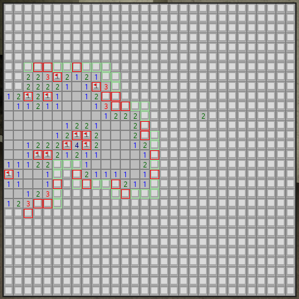

# solvr !

do not use until further notice

# notice

a certain group of people are calling this malware because they got banned in a friend group discord over starting arguments

the code is open source, and the main.py has zero detections, zero antivirus flags, and you can clearly see does nothing malicious

[google search that pyinstaller onefile is known for false positives because of how it functions](https://www.google.com/search?q=pyinstaller+onefile+false+positive)

[a website to decompile pyinstaller exes yourself so that you can see that it isn't malware](https://pyinstxtractor-web.netlify.app/)

[a video showing the repo being built and that it false positives](https://www.youtube.com/watch?v=PCoBPS2nXqk)

go build the file yourself with onefile on pyinstaller and see that it'll flag

or literally just look at the code (it's open source!)

  
